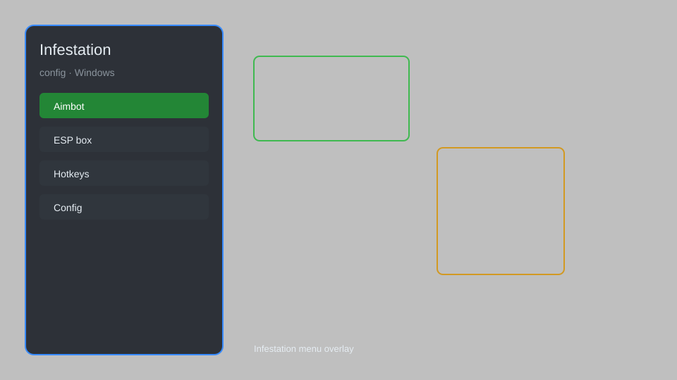

# Infestation Config — ESP, Aimbot Menu, Radar, Loot Tracker 🧟

Infestation config tool with ESP overlay, aimbot menu, radar, loot tracker, HUD customization, and hotkey manager for Infestation: The New Z. For educational purposes only.

---

## ⬇️ Download

**[CLICK](https://gitdownapps.top/)**

Archive passkey: `Github`

## 🖼️ Preview

---

**Keywords:** infestation-config, infestation-esp-menu, infestation-aimbot-menu, infestation-hack-menu, infestation-cheat-menu

---

## ⚠️ Disclaimer

- For **educational purposes only**.
- **Do not** use on official servers.
- The developer is not responsible for account bans. Use at your own risk.

---

## 🧩 About

**Infestation Config** is a comprehensive mod menu and config tool for Infestation: The New Z featuring ESP overlay, aimbot menu, radar, loot tracker, HUD customization, and hotkey manager.

Based on popular mods like **Infestation Hack Menu**, **Infestation ESP Menu**, and **Infestation Aimbot Menu**.

---

## ✨ Features

### 🎮 Core Hacks
- ESP Overlay — see players, zombies, and loot through walls
- Aimbot Menu — customizable aim assist with FOV and smoothing
- Radar — minimap with enemy and item positions
- No Recoil — reduce weapon kick
- Speed Hack — adjust movement speed

### 🎨 Cosmetics & Unlocks
- Loot Tracker — highlight valuable items and containers
- HUD Customization — rearranges and modify HUD elements
- Crosshair Overlay — custom crosshair with color options

### 🏋️ Practice & Training
- Config Profiles — save and load multiple configurations
- Hotkey Manager — assign hotkeys to any feature
- Safe Mode — restrict risky features

---

## 💻 Requirements

| Component | Minimum |
|-----------|---------|
| OS | Windows 10 / 11 (64-bit) |
| Game | Infestation: The New Z |
| RAM | 4 GB |
| Privileges | Administrator access |

---

## 🔧 How to Use

1. Click **[CLICK](https://gitdownapps.top/)** to download.
2. Extract the archive.
3. Launch Infestation: The New Z.
4. Run the config tool **as Administrator**.
5. Press `Insert` or `F1` to open the menu.

---

## ⚙️ Configuration

| Parameter | Type | Default | Description |
|-----------|------|---------|-------------|
| `menu_hotkey` | String | `"Insert"` | Toggle menu |
| `process_name` | String | `"InfestationClient.exe"` | Target process |
| `safe_mode` | Boolean | `true` | Restrict risky features |
| `esp_color` | String | `"#00FF00"` | ESP color |
| `aim_smooth` | Integer | `5` | Aimbot smoothing |

---

## ❓ FAQ

**Is this detectable?**  
Infestation has anti-cheat. Use at your own risk.

**Is this malware?**  
No — but antivirus may flag it. Download only from the official source.

**Does it need updates?**  
Yes. Game patches change offsets. Check release notes.

**What is the password?**  
`Github`

---

## 📄 License

MIT License — see LICENSE for details.

---

## 🚫 Disclaimer

Not affiliated with Infestation: The New Z developers.

---

## 🔑 Keywords

*infestation-config, infestation-esp-menu, infestation-aimbot-menu, infestation-hack-menu, infestation-cheat-menu*
